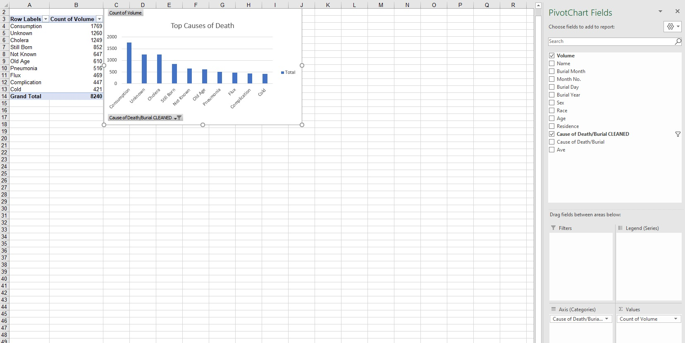
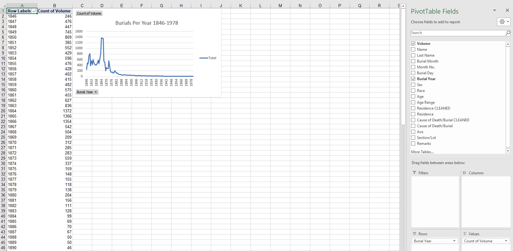
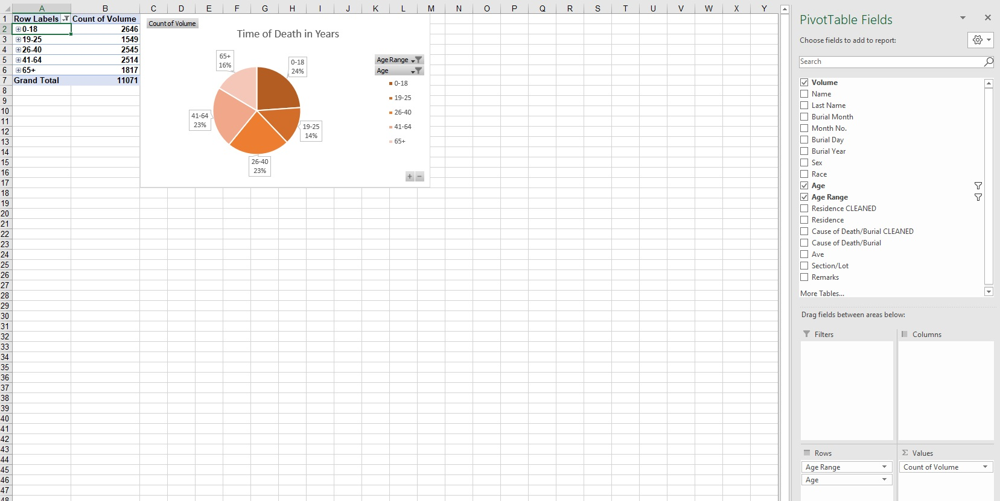
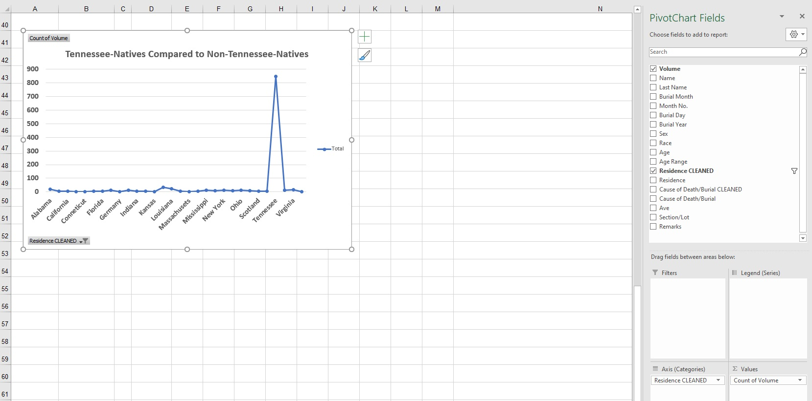
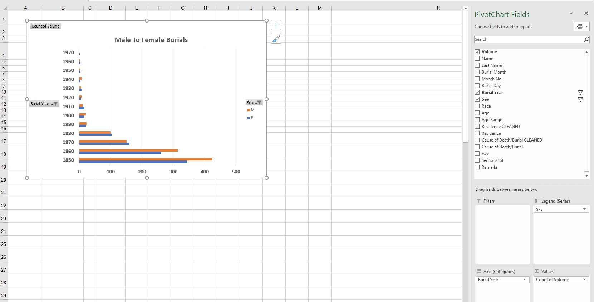
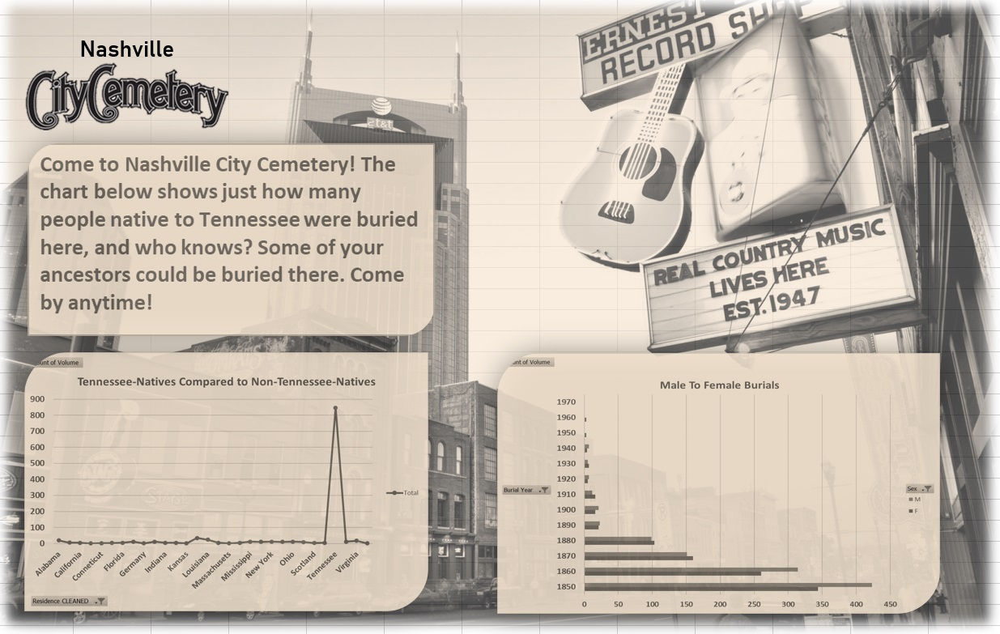

# city-cemetery-project

# Introduction

For this project, I was assigned with creating marketing material for the Nashville City Cemetery, which required analyzing and filtering data through the use of pivot tables. For this project I used Excel.

Data Sources: The data for this project was provided by the Nashville City Cemetery, here is a link to their website: [Nashville City Cemetery Website](http://www.thenashvillecitycemetery.org/)

# Table of Contents
* [Introduction](#Introduction)
* [Excel Walkthrough](#Excel-Walkthrough)
* [Marketing Material](#Marketing-Material)

# Excel Walkthrough
1. The data starts with a total of 19746 rows and 16 columns detailing the burial information for each person in the cemetery dataset. Sadly I am not able to show the full dataset at the request of Nashville City Cemetery.

2. For the first pivot table, I wanted to look at the top causes of death in the dataset and chart the results, so I used the cause of death column and the count of the volume column. The top cause of death was consumption.

3. For the second pivot table, I looked at the burials per year. I used the count of volume column and the burial year column to chart what years had the highest burials. 1861-1868 had the most burials, which falls closely in line with the years during and following the Civil War.

4. The third pivot table I created focused on the time of death for people in the cemetery. I used the age range column as well as a count of volume to see what age group had the most burials. Sadly, the age range with the most burials is in the 0-18 year-old range.

5. For the first pivot chart used for marketing material, I cleaned the residence column of any null values and misspellings to find out how many people buried at the cemetery were native to Tennessee.

6. For the second pivot chart used for marketing material, I cleaned the sex column of any null values to find out how many people buried at the cemetery were male or female.

# Marketing Material

Here is the marketing material I created for Nashville City Cemetery, highlighting some of my favorite insights from the dataset.

